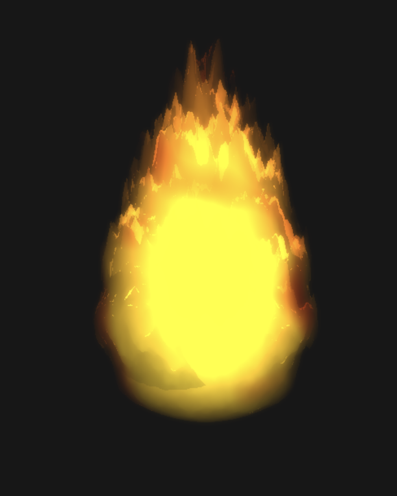

# Fireball Animation

Sphere turned fireball ([live demo](https://mzschwartz5.github.io/fireball/))! This is a WebGL project, using vertex and fragment shaders and some postprocessing to animate a fireball. I made a video roughly detailing each step of the creation process, so this is going to be more of a WATCHME than a README:

 

    
    
<em>This is a video! Click the image to see the making of the fireball!</em>

## Notes

There's really just one thing I want to talk about that I didn't really call out in the video - and that's the music-driven motion of the fireball. The site calls Spotify's APIs to search for and play the music, but they also have an API to provide audio analysis. They won't provide the raw MP3 file, but they have rough data about the loudness and tempo of each section of a song, which I'm using to drive the amplitude and frequency of the fireball's pulsating motion.

I had some trouble finding a mathematical function that produced the right shape pulse. At first, I was playing around with power curves and cubic pulses, but it was difficult to get the peak sharp enough without doing unnecessarily expensive computations (`e.g. x^30`). Then I remembered something from my physics undergrad - the Dirac delta function:

    <em>Play around with it it on <a href="https://www.desmos.com/calculator/lksm1xiayl">Desmos</a></em>

 

It's literally designed to have an infinitely sharp peak as `a` approaches 0. And, unlike power curves, it doesn't get computationally more expensive to make the peak sharper!

### Bloopers

Here's an outtake from the process of creating the tendrils, early on, that I just find particularly humorous and would like to immortalize on this README:

    

